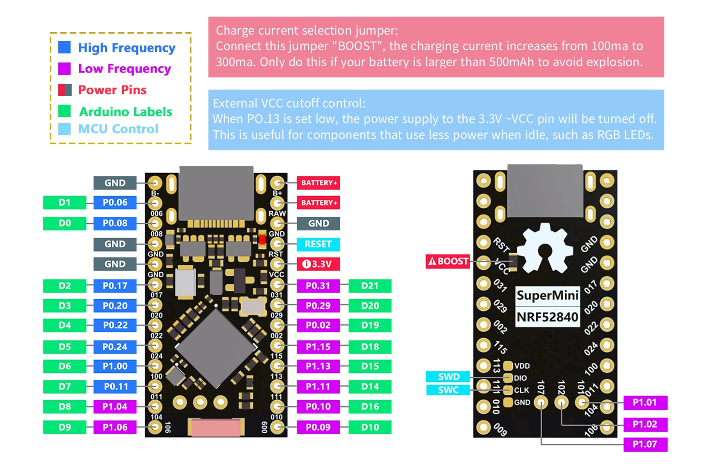
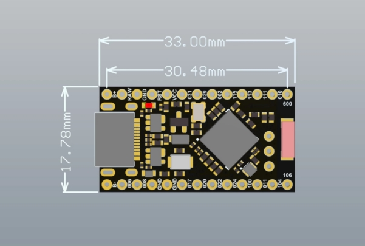

# nRF52840

## VSCode + nRF Connect

### Instalation

Install VSCode extension "nRF Connect for VS Code Extension Pack".

### Build UF2 file

For board with Adafruit bootloader UF2 image file is used to flash the program. Automatic UF2 file generation needs to be enabled in the project configuration file _prj.conf_. Along with this, a ROM offset must be defined. Nice!Nano with [Adafruit nRF52 bootloader](https://github.com/adafruit/Adafruit_nRF52_Bootloader) uses only MBR and has ROM offset 0x1000 (more about ROM offset see [RAM and Flash adjustment](https://devzone.nordicsemi.com/guides/short-range-guides/b/getting-started/posts/adjustment-of-ram-and-flash-memory)).

```text
CONFIG_BUILD_OUTPUT_UF2=y
CONFIG_ROM_START_OFFSET=0x1000
```

After project build file _zephyr.uf2_ will be located in _/build/zephyr/_ folder.

### Flash UF2 file

To flash UF2 file just copy file into Nice!Nano Adafruit bootloader mass storage. To flash UF2 file from VSCode custom flash task is necessary, because nRF Connect does not support UF2 runner.

* First, create a batch file to copy UF2 image ([uf2_flash.cmd](uf2_flash.cmd) in this example). Place this file into workspace folder.
* Second, create a new task for VSCode in _task.json_ (located in .vscode folder of workspace):

```json
{
    "version": "2.0.0",
    "tasks": [
        {
            "label": "UF2 Flash",
            "type": "shell",
            "command": "${workspaceFolder}/uf2_flash.cmd ${workspaceFolder}",
            "problemMatcher": [
                {
                    "pattern": {
                        "regexp": "^(Warning|Error):\\s+(.*)$",
                        "severity": 1,
                        "message": 2
                      }
                }
            ],
            "presentation": {
                "echo": true,
                "reveal": "always",
                "clear": false,
                "showReuseMessage": true,
                "revealProblems" : "onProblem"
            }
        }
    ]
}
```

* Third, bind task to flash action by _Flash_ context menu _Bind task to action_ or by using _settings.json_ file (located in .vscode workspace folder):

```json
{
    "nrf-connect.taskBindings": {
        "flash": [
            {
                "taskName": "UF2 Flash"
            }
        ]
    }
}
```


## SuperMini nRF52840

SuperMini nRF52840 is a Pro Micro alternative development board that is compatible with Nice! Nano. The nRF5280 development board has a 3.7V lithium battery interface and a software switch that can cut off the power of the LED. When turned off, the standby power consumption can reach 1mA.

### Parameters

64 MHz Cortex-M4 with FPU
1 MB Flash, 256 KB RAM
Bluetooth 5.4
2 Mbps, 1 Mbps, Long Range
Bluetooth Low Energy, Bluetooth mesh
ANT, 802.15.4, Thread, Zigbee
+8 dBm TX Power
128-bit AES CCM, ARM CryptoCell
UART, SPI, TWI, PDM, I2S, QSPI
PWM
12-bit ADC
NFC-A
USB 2.0

### External Battery

If you need an external battery, you only need to connect the + stage of the battery to B+ and the negative stage to B-. The external lithium battery only supports 3.7V and the charging rate is 100mA (a 2000mAh battery takes 20 hours to be fully charged).

### External VCC control

When P0.13 is set to low, the power supply to the 3.3V, VCC pin will be turned off.

### Bootloader

To enter Bootloder, short RST to GND twice within 0.5s. Connect to the computer via USB and a storage device called Nice! Nano will be displayed. To burn the program copy the .uf2 file into target Nice!Nano.

### Debugging

Debugging via SWD pads.

### Issue

5.6K pull-up resistor between power pin and VDDH (leaks about 3.6V/5.6K ~650mA when power pin is set to 0). Resistor should be replaced.

### Pin diagram



### Dimensions


